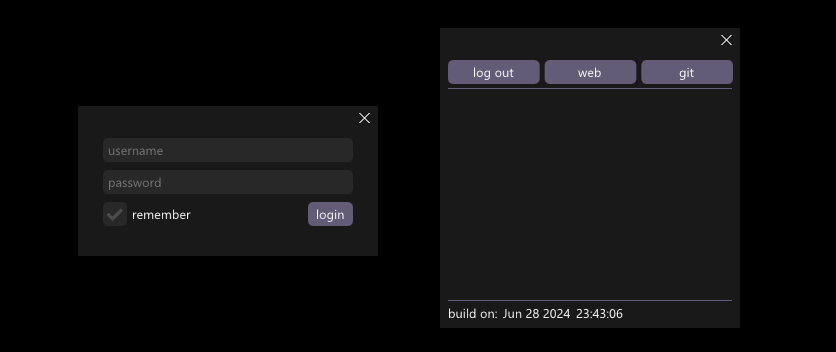
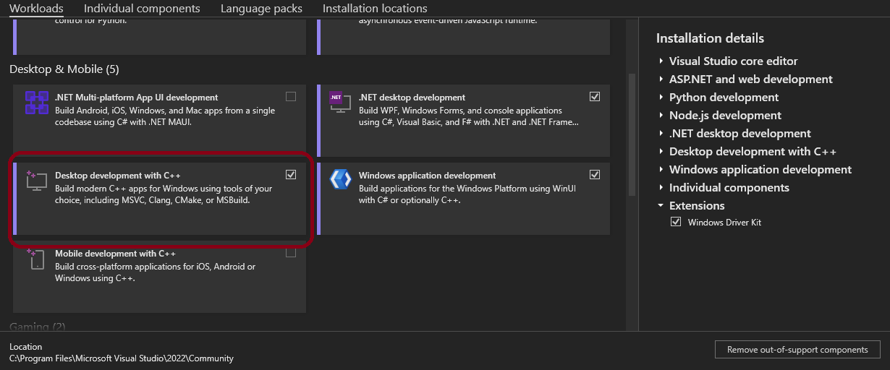
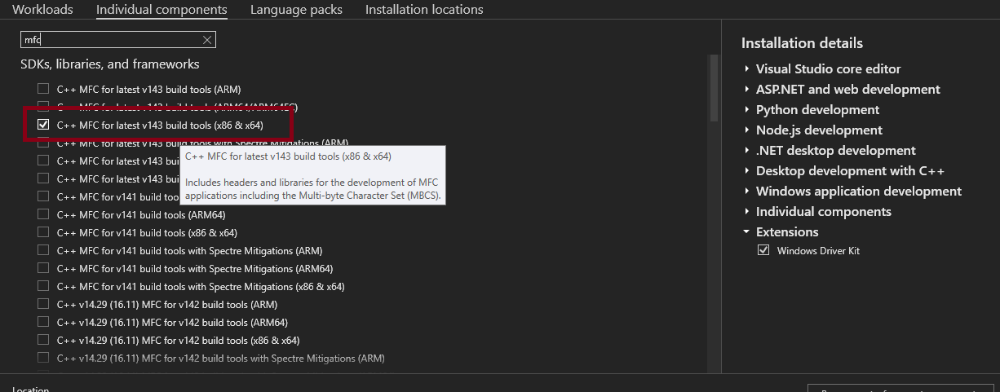

# ImGui AppKit
This is a simple project template that you can use to quickly start developing simple, single-window GUI apps for [Microsoft Windows](https://www.microsoft.com/en-us/windows). It uses [Dear ImGui library](https://github.com/ocornut/imgui) and heavily utilizes its [multi-viewports functionality](https://github.com/ocornut/imgui/wiki/Multi-Viewports).

**Pros:**
- Compiles into a single 500kb .exe file with zero dependencies.*
- If you are familiar with [Dear ImGui](https://github.com/ocornut/imgui), you will be able to get from concept to working app in a matter of minutes.

**Cons:**
- Only single-window apps are supported (currently, though it's easy to extend yourself).
- Since [Dear ImGui](https://github.com/ocornut/imgui) is an immediate-mode GUI library, your GPU will need to constantly re-render frames even if nothing changes.

**DirectX 11 comes preinstalled on Windows 10+, MFC static linking required.*

## Screenshots
Those two example windows are implemented in the project.

## Compiling
1. Download [Visual Studio 2022](https://visualstudio.microsoft.com/vs/) (Community Edition is fine).
2. When installing, select "Desktop development with C++."

   

3. If you want to statically link MFC, also select "MFC for latest vXXX build tools (x86 & x64)" in the "Individual components" tab.

   

4. Open "App.sln" and build the solution. The "x64\Release" folder will contain "App.exe" if everything goes well.

## License
- [Dear ImGui](https://github.com/ocornut/imgui) is [licensed under MIT](https://github.com/ocornut/imgui/blob/master/LICENSE.txt).
- Files written by me are also under MIT (see App/Source/LICENSE.txt).